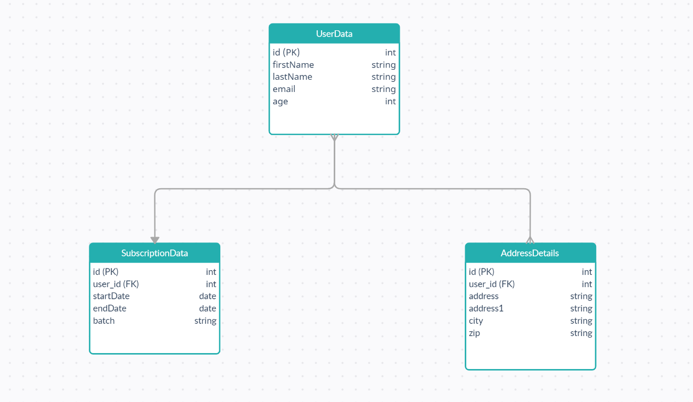

# Subscription Form

To run the app in the development mode:
```
cd payment-form
npm start
```
Server will start running at [http://localhost:3000](http://localhost:3000).

Age limit, Subscription Date, batch selection code was written inside the `PaymentDate` and `verifyAge` function in the `Form.jsx` file.

`onPaymentClick` function checks the details are filled or not if details are filled then `CompletePayment` function was executed.  

Details that are sent to the backend and stored in the database:
```
firstName, lastName, email, address, address1, city, zip, batch,
startDate, endDate, Age.
```

### Components:

App and Form (child of App component). index.js render the App component.

### Database Schema:
</br>

<a href="#" target="_blank"></a>

